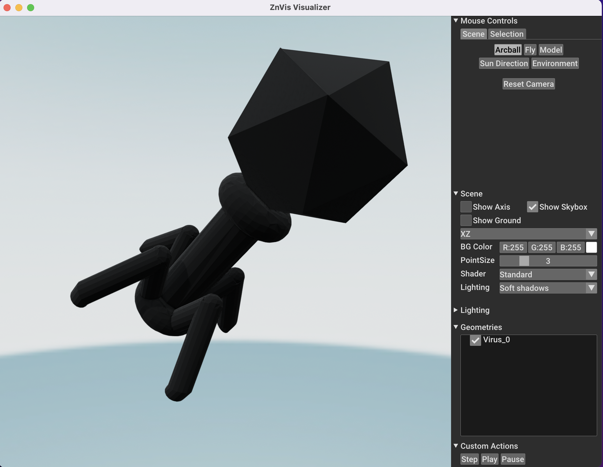

Custom mesh
-----------
ZnVis allows for the use of custom mesh files to be read in during the visualization.
This can achieved using the :code:`znvis.CustomMesh` class as follows:

.. code-block:: python

   # Define the particle type.
   virus_trajectory = np.random.uniform(-10, 10, (10, 1, 3))
   virus_orientation = np.random.uniform(0, 1, (10, 1, 3))

   virus_mesh = vis.CustomMesh(file='example_data/virus.stl')
   virus = vis.Particle(
       name="Virus",
       mesh=virus_mesh,
       position=virus_trajectory,
       director=virus_orientation
   )

   # Construct the visualizer and run
   visualizer = vis.Visualizer(particles=[virus], frame_rate=10)
   visualizer.run_visualization()

You should now see a screen that looks something like this:

If you now press the :code:`Play` button the particle should start moving.
