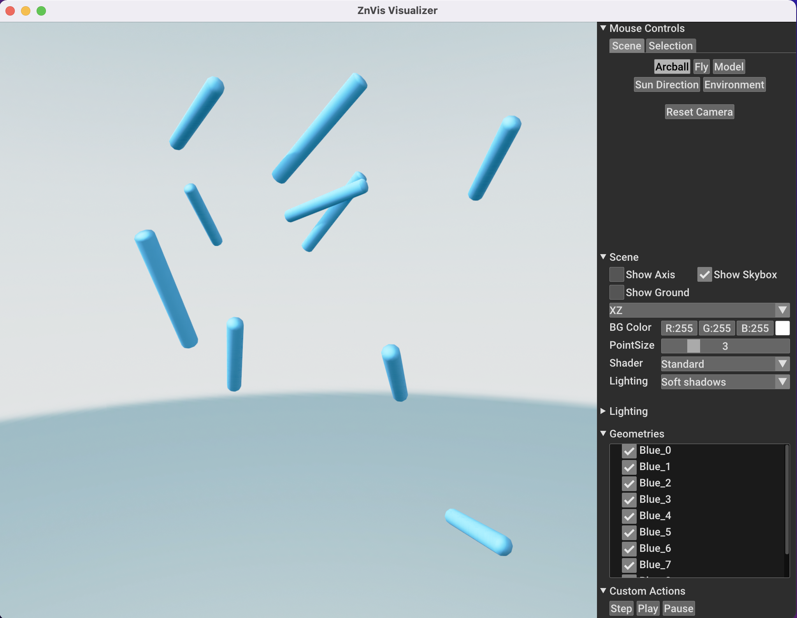

Simple Cylinders
----------------
In this example we will show how to visualize cylinders and include direction
information in a visualization.

Imports
^^^^^^^
The first thing to do is import the required packages.
For this tutorial, we use both numpy as znvis.

.. code-block:: python

   import znvis as vis
   import numpy as np

Setting up a particle
^^^^^^^^^^^^^^^^^^^^^
Now we can make a particle that ZnVis can visualize.
Let's start with some fake data generated randomly and then add this data to a
particle.

.. code-block:: Python

   trajectory = np.random.uniform(-5, 5, (100, 10, 3))
   orientation = np.random.uniform(0, 1, (100, 10, 3))

Notice here that not only do we generate trajectory data, but we also generate
orientation data.
This data consists of 3D vectors describing the direction that the particle is pointing
in.

Build and run the visualizer
^^^^^^^^^^^^^^^^^^^^^^^^^^^^
Now that the particles are prepared, we can set up the visualizer and run it.

.. code-block:: python

   visualizer = vis.Visualizer(particles=[particle, particle_2], frame_rate=20)
   visualizer.run_visualization()

Here we have passed the particle instance to the visualizer along with a frame rate
measured in frames per second.

Results
^^^^^^^

You should now see a screen that looks something like this:

If you now press the :code:`Play` button the particle should start moving.