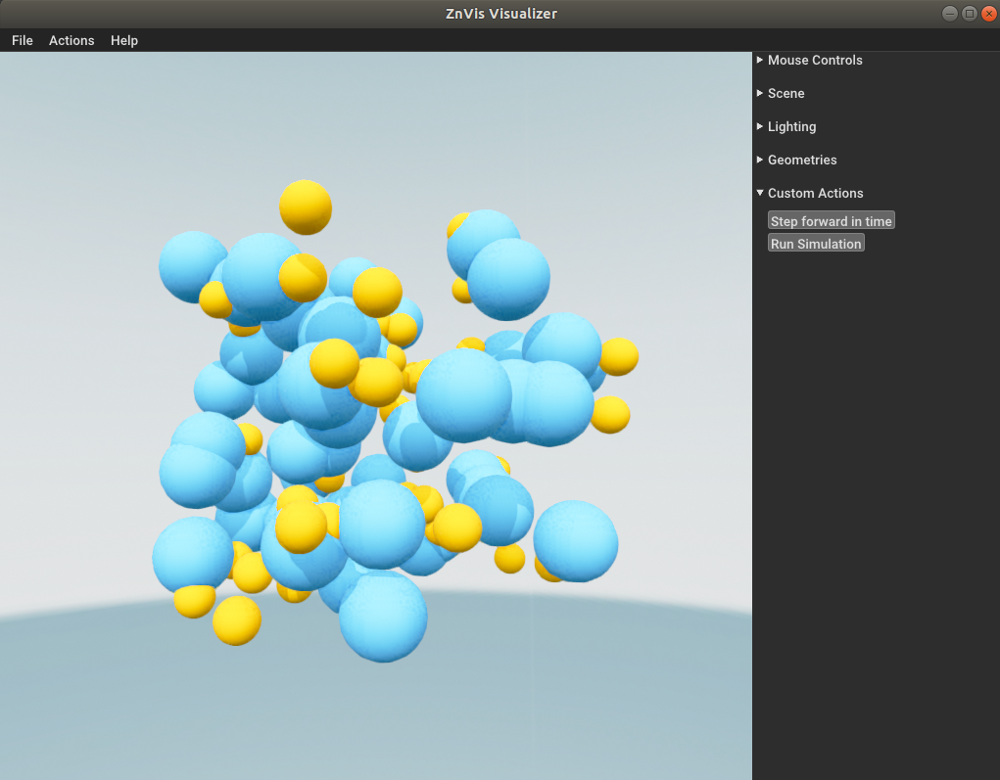

Simple spheres
--------------
In this example we will go through how to visualize simple spheres using ZnVis.

Imports
^^^^^^^
The first thing to do is import the required packages.
For this tutorial, we use both numpy as znvis.

.. code-block:: python

   import znvis as vis
   import numpy as np

Setting up a particle
^^^^^^^^^^^^^^^^^^^^^
Now we can make a particle that ZnVis can visualize.
Let's start with some fake data generated randomly and then add this data to a
particle.

.. code-block:: python

    trajectory = np.random.uniform(-10, 10, (100, 50, 3))
    mesh = vis.Sphere(radius=2.0, colour=np.array([30, 144, 255]) / 255, resolution=10)
    particle = vis.Particle(name="Blue", mesh=mesh, position=trajectory)

In this code we first generate fake trajectory data for 50 particles over 100 time
steps, define the shape of the particle as a blue sphere and add this information to
the :code:`znVis.Particle` class.

Now let's do this for the second particle.

.. code-block:: python

   trajectory_2 = np.random.uniform(-10, 10, (100, 50, 3))
   mesh_2 = vis.Sphere(radius=1.0, colour=np.array([255, 140, 0]) / 255, resolution=10)
   particle_2 = vis.Particle(name="Orange", mesh=mesh_2, position=trajectory_2)

Build and run the visualizer
^^^^^^^^^^^^^^^^^^^^^^^^^^^^
Now that the particles are prepared, we can set up the visualizer and run it.

.. code-block:: python

   visualizer = vis.Visualizer(particles=[particle, particle_2], frame_rate=20)
   visualizer.run_visualization()

Here we have passed to two particle instances to the visualizer along with a frame rate
measured in frames per second.

Results
^^^^^^^

You should now see a screen that looks something like this:

If you now press the :code:`Run Simulation` button the particle should start moving.
